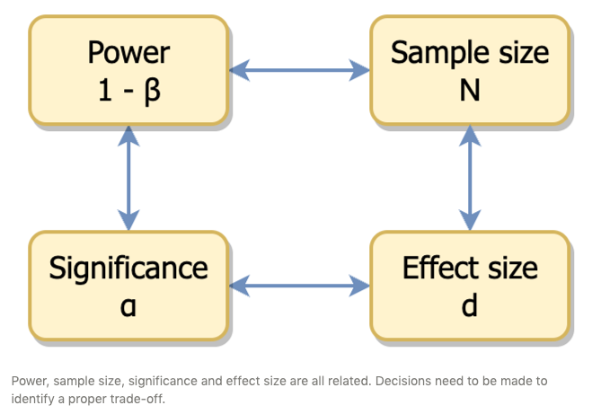
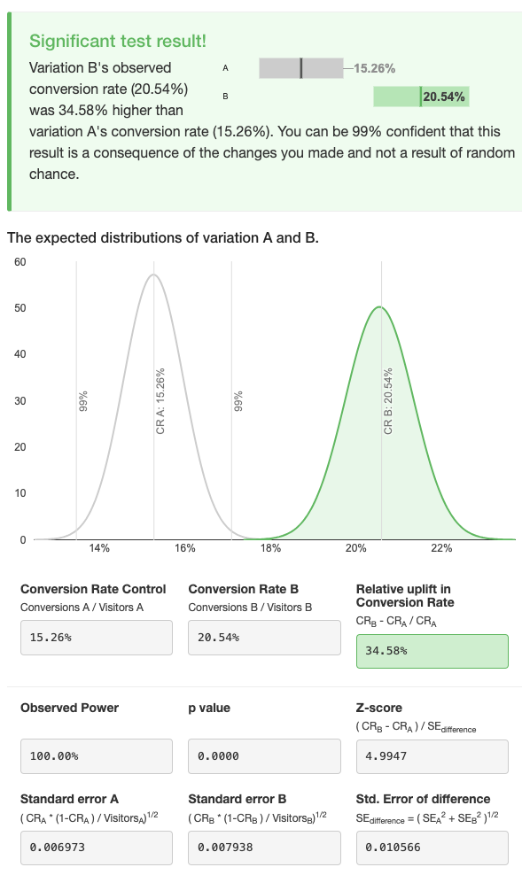

```{r, include=FALSE}
library(tidyverse)
```


## The purpose of A/B testing

**A/B test is used to decide which of two versions of a product works better** - e.g. which one of version A or B of a website landing page results in more subscriptions.

The stats underneath are usually very simple - in the basic case **a two independent samples t-test or chi-square test**.

Importantly, **the actual testing should be preceded by a power analysis** to appropriately design the experiment: undetected false positives and negatives can result in a considerable waste of time and money. A power analysis will help to limit the chance of either of them (and can be swiftly carried out with in a few lines or R code, as we will see below).

If one of the two versions turns out to be significantly better than the other, it is still worth paying attention to the **confidence intervals** around the point estimate of the difference between A and B, as this informs us about the _range_ of the outcome we can expect after having implemented the chosen version.


## Case study
You own a cafeteria where people come mostly to enjoy their cappuccino while chatting together. However you realize that the number of people who use the cafeteria as their office is increasing, and you want to attract these digital nomads to your cafeteria. 

To this aim, you are thinking to replace the main image appearing on Google Maps when people look for a cafeteria in your neighbourhood - from an image A showing two friends chatting over a coffee, to an image B depicting a cafeteria table transformed into a co-working space.

To understand whether this is a good idea, you implement both versions and measure how many of the users who click on your cafeteria will then click on the button to ask directions to your place.


The point is to estimate whether the new image will draw more users to click on the button for directions to your cafeteria.

This can be tested using an A/B test.


## Power analysis
The data onto which the test is run are usually proportion of conversion - e.g. to subscription or purchase. The absolute difference between them however will tell us little about the probability that that difference has been achieved by chance (i.e. null hypothesis). 

In order to decide whether the difference in conversion is worth exploring, it is important to first decide on a few items:

- **(Up)lift** or _effect size_ : what change in the proportion of conversion I am expecting? Or, from a business-oriented perspective: what is the increase in conversion which will make the change financially viable and/or profitable? For instance, if the conversion rate increases 5%, is this enough to justify the expenditure needed to run the test? 

- **Significance level**, or _alpha_ : what is the risk I want to accept to detect a difference which is actually due to chance (Type I error)?  Usually alpha is set to 0.05 or 0.01.

- **Power** : what is the risk I want to accept _not_ to find an actual difference (beta)? Power is 1-beta, and it is usually set at 0.8. This denotes the probability of finding an effect which is actually present, rather than due to chance.

- **Sample size** : this is the amount of data points I need to have in order to detect a significant and actual difference - of the expected size - given the chosen significance level and power. In practice, this means how much time do I need to wait to know whether A is more effective than B or _vice versa_. Note that bigger differences require smaller samples (i.e. less time), however this might lead to _failure to detect_ a difference smaller than the expected. 

Probably the most important information here is the fact that these four elements are all linked to each other: changing one will affect the others. 



Balancing these four elements in order to plan an effective A/B experiment is the purpose of power analysis. 

For instance, let's say that each day 200 people click on the image of your cafeteria every day. Out of these, 30 people (15%) "convert" to asking directions to reach your cafeteria. By changing the image in google maps, you hope to convince 40% more people to ask for directions (i.e. 42 people, or 21%). 

If we keep the sigificance level and power at 0.01 and 0.8 respectively, for how many days should you run the test to assess the efficacy of either options in attracting people to your cafeteria?

```{r}

clickers_per_day = 200
pA = 30/clickers_per_day
uplift = 0.4

pB = pA * (1 + uplift)

pw <- power.prop.test(p1=pA, p2=pB, power=0.8, alternative='two.sided', sig.level=0.01)
pw

Ndays_runtime <- pw$n / 200
cat("Experiment runtime:", Ndays_runtime * 2,"days") # the computed sample size is for *each condition!*
```

This is great news. If a 40% uplift is expected/desired, it would take about 10 days to run the test and decide which version of the cafeteria photo to use.

At the same time, this will prevent us to detect an uplift < 40%. Detecting a smaller difference would require a larger sample, but might still be interesting.

Let's see how many participants would be required to detect an A/B effect of different sizes - with a power of 0.8 and a significance level of 0.01.

```{r}

power_range <- function(pA, uplift) {
 pB = pA * (1+uplift)
 pw <- power.prop.test(p1=pA, p2=pB, power=0.8, alternative='two.sided', sig.level=0.01)
 return(pw$n)
}

uplift_list <- seq(0.1,0.5,0.05)

sample_size <- uplift_list %>% map_dbl(~ power_range(pA, .x)) %>% round

# cbind(uplift_list, sample_size)

bp <- barplot(sample_size, names.arg = uplift_list, ylim = c(0, max(sample_size) + 1000))
text(bp, sample_size, labels = sample_size, pos = 3, cex = 0.8, col = "black")

```

After considering these alternative uplifts, you decide that an uplift of 35% in conversions would still be interesting/profitable for your cafeteria, and it would take only a few days more wrt to the initial 40% uplift expectations (1229 * 2 / 200 = less than two weeks). You therefore decide to to run the experiment for two weeks.


## Hypothesis testing 

After two weeks, you finally have your data, and can run the actual test. For simplicity, let's calculate the total number of visitors/conversions by multiplying the respective average value times 14 (days).

```{r}

Ndays_runtime = 14

N_A = 190
n_conv_A = 32

N_B = 185
n_conv_B = 38

df <- tibble(
 photo = c("B","A"),
 n_conversions = c(n_conv_B,n_conv_A) * Ndays_runtime,
 N_visitors = c(N_B, N_A) * Ndays_runtime
) %>% 
 mutate(conversion_rate = (n_conversions / N_visitors) %>% round(4))

df %>% print()

```


The main idea is that we want to assess whether the two proportions come from the same binomial distribution. There are two ways to do this:

- z test from proportions - CLT-based normality approximation of the binomial distribution
- chi-square test


_If_ we had continous data (e.g. revenues for version A or B), we would just use a Student's T test (or Welch test). For the case of equal variances, this amount to:

$$T_{dof} = \frac{ \bar{x}_A - \bar{x}_B}{\sqrt{\frac{s^2_A}{n_A} + \frac{s^2_B}{n_B}}}$$

where $SD_{pooled} = \sqrt{\frac{s^2_A}{n_A} + \frac{s^2_B}{n_B}}$ is the pooled standard deviation of the two samples.

In the case of proportions we refer to the binomial distribution, where the mean (expected value) is $n \cdot p$ and the variance is $n \cdot p \cdot (1-p)$. For sufficiently large samples (e.g. > 1000), we can approximate a binomial distribution with a gaussian having parameters:

$$\mu = p, \sigma = \sqrt{\frac{p(1-p)}{n}}$$
This allows us to formulate a test for the difference between the two proportions in a similar way to the t test:

$$z = \frac{p_B - p_A}{\sqrt{SE_A^2 + SE_B^2}}$$
where $SE_A$ is the standard error for A (and analogously for B)

$$SE_A = \sqrt{\frac{p_A(1-p_A)}{N_A}}$$
Finally, we compare the obtained Z with the critical value for the chosen significance level.

Let's implement this:

```{r}

nconv_B <- df$n_conversions[1]
nconv_A <- df$n_conversions[2]

N_B <- df$N_visitors[1]
N_A <- df$N_visitors[2]

pA = nconv_A / N_A
pB = nconv_B / N_B

SE_B <- sqrt(pB * (1-pB) / N_B)
SE_A <- sqrt(pA * (1-pA) / N_A)

SE_diff <- sqrt(SE_B^2 + SE_A^2)

z <- (pB - pA)/SE_diff

# two-tails test
pval <- 2 * (1 - pnorm(abs(z)) )
print(pval)
```

A quick graphical display of the comparison, together with all the elements of the calculations, can be obtained using the [AB Testguide website](https://abtestguide.com/calc/)




Alternatively, we can use the Pearson chi-square test, to test whether the two distributions - sampled in our pA and pB observations - are the same

$$\chi^2 = \sum{\frac{(O_i - E_i)^2}{E_i}}$$

In this case we can either use the `prop.test()` function, or the `chisq.test()` function.


```{r}

ABresult <- prop.test(df$n_conversions, df$N_visitors, correct = F, conf.level = 0.95)
print(ABresult)

```

If we want to use the chi-square test function directly, we need to reshape our observation into a contingency table.

```{r}

contingency_table <- matrix(c(n_conv_B, n_conv_A, N_B - n_conv_B, N_A - n_conv_A), ncol = 2)
colnames(contingency_table) <- c("YES_Conv", "No_Conv")
rownames(contingency_table) <- c("B", "A")

contingency_table <- contingency_table * Ndays_runtime

chisq.test(contingency_table, correct = F)
```

The final results are of course exactly the same, and they are (as expected) comparable to those obtained using the normal approximation of the binomial distribution.

<br>

## Insights from the analysis

It appears that we can be reasonably confident that implementing option B - the photo of the cafeteria as a workplace - will increase the conversion rate, and therefore our profit.

But there are more interesting information we can gather from our analysis:

1. **The observed conversion rate for the baseline variant (photo of cafeteria as a meeting place) matches our expectations**. Of course, this happened here because we actually created the data _ad hoc_, but the point to retain is that it is important to check whether our initial expectation about the baseline is met by the observation. 

2. **The efficacy of the new photo is smaller than expected**. We were expecting to increase the conversion rate by 35-40%. As a matter of fact, the result from the experiment is that the new picture increases conversion "only" by 25% with respect to the baseline. We must therefore evaluate whether this option is still interesting for our business

3. We said that from the results we can be _reasonably confident_ that implementing option B will increase our profits 25% with respect to the actual conversion rate. We can attach a quantitative meaning to this _confidence_, namely by looking at the confidence intervals for this result. 


## Confidence interval

Confidence intervals (CI) are used to estimate the range of the true (but unknown) value of our parameter of interest from our sampling distribution, with a given confidence level (e.g. 95%).

$$CI = [\hat p_{Diff} + z_{CL} \cdot SE_{Diff}; \hat p_{Diff} - z_{CL} \cdot SE_{Diff}; ]$$
Where:

- $\hat p_{Diff} = \hat p_B - \hat p_A$, that is the difference between the two estimates of conversion rate
- $z_{CL}$ is the probability associated with our confidence level, e.g. 95%
- $SE_{Diff}$ is the standard error of the difference between the two proportions, as calculated above

It is the range in which the difference of the conversion rates would be found if the experiment would be repeated many times.

The CI can be used for inference, alternatively to the null-hypothesis testing approach. Specifically, if the CI _includes_ 0 (or another value that would make the difference between the two conversion rates not interesting), then we can conclude that there is no significant difference in the efficacy of A or B in terms of conversion rates.

In our case we can calculate the CI as follows:

```{r}

# for a 95% confidence level
alpha = 0.05
z_CL <- qnorm(1-(alpha/2))

# Margin of error
MOE <- z_CL * SE_diff

CI_low  <- (pB - pA) - MOE
CI_high <- (pB - pA) + MOE

cat("95% CI around the difference between pB and PA: [",CI_low,CI_high,"]")

```

As expected, this CI does _not_ contain 0, therefore we reject the null hypothesis of no difference between the two conversion rates.

Importantly, the CI can also be used to compare what we expect in the future - based on our experiment - with what we will actually obtain.  

For instance, one month after we implement photo B (cafeteria as a shared workplace), we might get a 19% increase in conversion rates, rather than the expected 20.5%. While this might disappoint us, it is indeed within the range described by our confidence interval.

In fact, our CI around the difference in coversion rates (`r paste0(round((pB - pA)*100, 2),"%" )`) ranges between `r paste0(round(CI_low*100, 2),"%" )` and `r paste0(round(CI_high*100, 2),"%" )`. This means that while our point estimate for the conversion rates is `r paste0(round(pB*100,2),"%")`, based on our CI we can expect is to range from `r paste0(round((pA + CI_low)*100,2),"%")` (pA + CI_low) to `r paste0(round((pA + CI_high)*100,2),"%")` (pA + CI_high).


```{r, include=F, eval=F}

# Garbage collector


# Sample calculation
data from [here](https://www.linkedin.com/pulse/confidence-intervals-ab-testing-results-surbhi-jain/)

N1 = 21943378
c1 = 4159700
p1 = c1/N1

N2 = 21871783
c2 = 4165770
p2 = c2/N2

lift <- (p2 - p1) / p1 * 100

SE1 = sqrt( (p1*(1-p1)) / N1 )
SE2 = sqrt( (p2*(1-p2)) / N2 )

SE_diff = sqrt( SE1^2 + SE2^2 )

z <- (p2 - p1) / SE_diff
z

pval <- 2 * (1 - pnorm(abs(z)) )
print(pval)

# for a 95% confidence level
alpha = 0.05
z_CL <- qnorm(1-(alpha/2))

# Margin of error
MOE <- z_CL * SE_diff

CI_low <- ((p2 - p1) - MOE)
CI_high <- ((p2 - p1) + MOE)

prop.test(x = c(c2,c1), n = c(N2,N1), conf.level = 0.95, correct = FALSE)

# min lift: (p1 - p1 + CI_low)/p1
CI_low/p1*100

# max lift: (p1 - p1 + CI_high)/p1
CI_high/p1*100


# ----------------------------------
library(pwr)
pwr.2p.test(n=14750, sig.level=0.05, power=0.8)


```


## Links
[Kelly Wortham's Sample Size Calculation - Myth Buster Edition](https://www.searchdiscovery.com/blog/sample-size-calculation-myth-buster-edition/) and the associated [calculator app](https://www.searchdiscovery.com/how-we-help/services/optimization/sample-size-calculator/)

[AB Testguide calculator](https://abtestguide.com/calc/). Scroll to the bottom of the page for some technical articles.

[Georgiev Intervals and p-values for percent change](https://blog.analytics-toolkit.com/2018/confidence-intervals-p-values-percent-change-relative-difference/)

[MLwiki binomial proportion tests](http://mlwiki.org/index.php/Binomial_Proportion_Tests)

[MLwiki binomial proportion confidence intervals](http://mlwiki.org/index.php/Binomial_Proportion_Confidence_Intervals)

[Confidence intervals in A/B testing results](https://www.linkedin.com/pulse/confidence-intervals-ab-testing-results-surbhi-jain/)

[HBR refresher on A/B testing](https://hbr.org/2017/06/a-refresher-on-ab-testing)

[Khan on CI for the difference between proportions](https://www.khanacademy.org/math/ap-statistics/xfb5d8e68:inference-categorical-proportions/two-sample-z-interval-proportions/v/confidence-intervals-for-the-difference-between-two-proportions)

