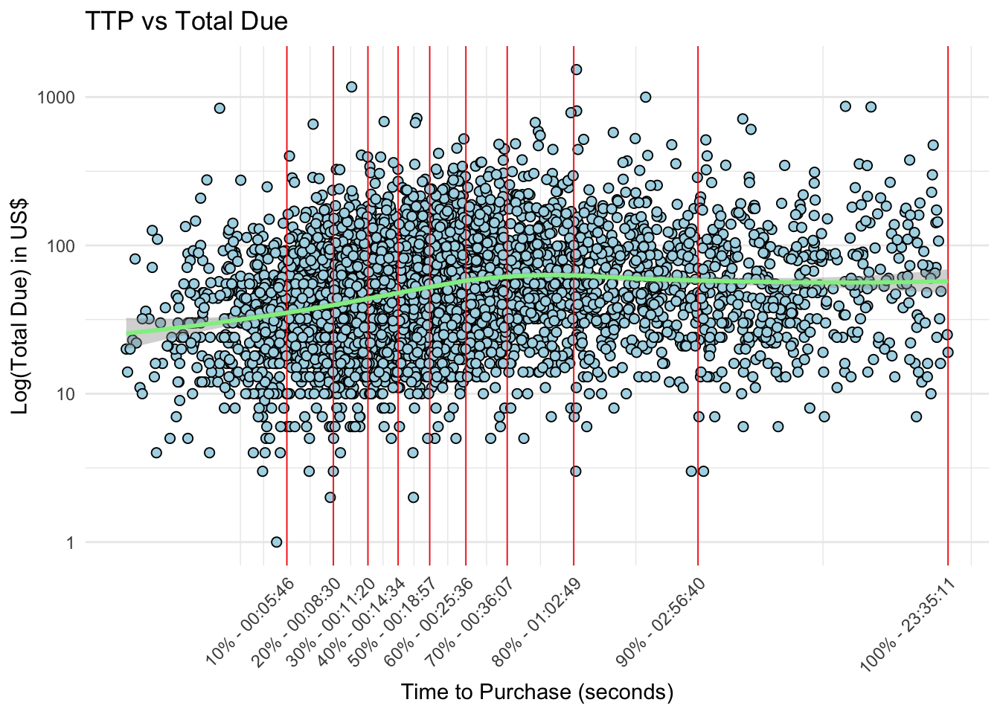

```{r message=F}
library(bigrquery)
library(tidyverse)
library(highcharter)
library(plotly)
library(lubridate)
library(echarts4r)
library(broom)
library(flextable)
library(reactable)
library(GGally)
library(jtools)
library(ggstatsplot)
library(viridis)
library(ggpubr)
library(htmltools)
library(ggpubr)

# library(dlookr)


# avoid the conflict with MASS::select
select <- dplyr::select

# local folder
# "~/Dropbox/turing_college/Modules/Marketing_Analysis/"

```


# Assignment
Data from the [google merchandise store](https://shop.googlemerchandisestore.com/) contains information about every browsing event from the user (e.g. page view, click item, scroll), as well as its date, timestamp, order amount and other device-specific information.

Currently **we are interested in analyzing the outcome of our marketing campaigns in the period from November 2020 to the end of January 2021**.

In particular, we are interested in assessing:

- whether the campaigns resulted in a higher **conversion from browsing to purchasing**
- whether this is related to the **amount of time spent on the website** (session length)
- what was the **impact on the revenues**

Importantly, we are also interested to **carry out the analysis for each day of the week** to assess whether there are some noticeable seasonal patterns.


# Data Preparation {.tabset}

```{r load_data, message=F}

# The data was too big to be exported in one csv, so we have to download
# individual months and row-bind them

nov <- read_csv("01_nov.csv")
dec <- read_csv("02_dec.csv")
jan <- read_csv("03_jan.csv")

df <- rbind(nov, dec, jan) 

df <- df %>% 
 
 # rename session_length as TTP (Time-To-Purchasing) and threshold to 1 hour
 rename(TTP = session_length) %>% 
 filter(TTP > 300, TTP < 3600) %>% 

 # mutate(campaign = ifelse(campaign == "(data deleted)", "generic_campaign", campaign)) %>% 
 # mutate(campaign = factor(campaign)) %>% 
 
 # identify sessions with purchase and browse-only sessions
 mutate(revenue = ifelse(is.na(revenue), 0, revenue)) %>% 
 mutate(purchase_session = ifelse(revenue > 0, "YES", "NO") %>% factor) %>% 
  
 # create columns for weekday_name and weekday_number
 mutate(weekday_num = wday(event_date, week_start = 1) %>% factor) %>% 
 mutate(weekday_name = wday(event_date, week_start = 1, label = T) %>% factor) 
 
```

::: {.panel-tabset}

## Identifying sessions
The database does not contain unequivocal information about the start and the end of a session, therefore we had to devise a suitable procedure for the existing data. This was carried out in SQL (the dataset consists of ~4 million rows). In brief:

- The session_start event was chosen to define the start of the session. Within the same day, different events with `event_name="session_start"` were assigned a rank according to their timestamp
- Every other event before the next session_start was labelled with this rank
- Session length was calculated as the difference in seconds between the session_start event and the last event before the subsequent session_start
- Events with no rank are those which belong to sessions started the day before, and were therefore not further considered


## Thresholding session length
In a previous Product Analysis we observed that the median length of a session is ~ 20 minutes, and that the order amount stops increasing for sessions longer than 30-60 minutes. 

Therefore we chose to focus on session no longer than 3600 seconds (1 hour). We also repeated the analyses below with other thresholds (20, 120 minutes or no threshold) and we observed virtually identical results.



## Pooling all campaigns together

We know that there is a problem with the data: the campaign reference of the purchases (e.g. Black Friday or New Year's eve) are lost, and were replaced with `(data_deleted)`. The very few remaining are related to events in sessions where the campaign was not recorded in the `purchase` event row, but still present among the events of that session - therefore we decided to assign that purchase to that campaign.

Still, the number of purchases in different campaigns is negligible with respect to the total number of data points, which prevents us to stratify the analysis per campaign.

```{r}

df %>% 
 select(campaign, purchase_session) %>% 
 group_by(campaign, purchase_session) %>% 
 count %>% 
 mutate(
  purchase_session = ifelse(purchase_session=="YES","purchase session","browsing only")
 ) %>% 
 pivot_wider(names_from = purchase_session, values_from = n) %>% 
 mutate(`purchase session` = ifelse(is.na(`purchase session`),0,`purchase session`)) %>% 
 flextable
 
```

<br>

Therefore we will aggregate all the different campaigns into a generic campaign YES/NO column, and examine the other metrics (revenue and TTP) according to whether they relate to *any* campaign or to no campaign.

```{r simplify_campaign_column, message=FALSE, warning=FALSE}
df <- df %>% 
 mutate(campaign = ifelse(campaign == "none", "NO", "YES") %>% factor)
```


:::


<br>


# Analysis

## Fail to increase conversion rate {.tabset}

**Overall, we don't obseve a difference in the conversion rate** - from browsing only to purchasing - **due to campains**

When no campaigns are present on the website, 7% of all the visits result in a purchase. Comparably, when a campaign is running, 6% of the visitors end up purchasing.

The conversion rate for campaign sessions appears to be slightly higher on Thursday and Friday, but not more than what can be expected by chance.

::: {.panel-tabset}

### Overall conversion rate

```{r association_campaign_purchase_2, message=FALSE, warning=FALSE}

contingency_table <- df %>% 
  select(campaign, purchase_session) %>% 
  group_by(campaign, purchase_session) %>% 
  count() %>% 
  pivot_wider(names_from = purchase_session, values_from = n, values_fill = 0)

# --------------  ggbarstats --------------------------

# Conversion rate across all days
ggbarstats(
 data = df,
 x = purchase_session,
 y = campaign,
 label = "both",
 results.subtitle = F
) + 
 scale_fill_manual(values = c("#F8766D","#00BFC4")) +
 labs(
  title = "Conversion rate in all sessions (campaign and no-campaign)",
  x = "Campaign"
 )


# The following two are replaced by the line plot in the next tab

# # Conversion rate for each day in campaign sessions
# ggbarstats(
#  data = df %>% filter(campaign == "YES"),
#  x = purchase_session,
#  y = weekday_name,
#  label = "both",
#  results.subtitle = F
# ) +
#  scale_fill_manual(values = c("#F8766D","#00BFC4")) +
#  labs(
#   title = "Conversion rate in campaign sessions",
#   x = "Day of the week"
#  )
# 
# 
# 
# # Conversion rate for each day in no-campaign sessions
# ggbarstats(
#  data = df %>% filter(campaign == "NO"),
#  x = purchase_session,
#  y = weekday_name,
#  label = "both",
#  results.subtitle = F
# ) +
#  scale_fill_manual(values = c("#F8766D","#00BFC4")) +
#  labs(
#   title = "Conversion rate in NO-campaign sessions",
#   x = "Day of the week"
#  )


```


### Per weekday

```{r association_campaign_purchase}

# Barplot and line plot of the conversion rates
ddf <- df %>%
 group_by(weekday_name, campaign, purchase_session) %>% 
 count() %>% 
 group_by(weekday_name, campaign) %>% 
 mutate(total = sum(n)) %>% 
 filter(purchase_session == "YES") %>% 
 mutate(conversion_rate = round(n/total*100,1))  
 # select(weekday_name, campaign, conversion_rate)


ddf %>%
 mutate(campaign = fct_rev(campaign)) %>% 
 ggplot(
  aes(x = weekday_name, y = conversion_rate, color = campaign, 
      group = campaign,
      text = paste("Campaign:", campaign, "<br>Conversion Rate:", conversion_rate, "%"))
 ) +
 # geom_bar(aes(fill = campaign), stat = "identity", position = "dodge") +
 geom_line() +
 geom_point() +
 theme_minimal() +
 labs(
  title = "Conversion rate for campaing and no-campaign sessions",
  x = "Day of the week",
  y = "Conversion Rate"
 ) +
 scale_y_continuous(labels = scales::percent_format(scale = 1)) -> gg

ggplotly(gg, tooltip = "text", config = list(displayModeBar = FALSE))

```


### No significant difference in proportions

```{r prop_test}

# Wednesday
prop_Thu <- ddf %>% 
 filter(weekday_name == "Wed") %>% 
 rename(n_converted = n) %>% 
 ungroup() %>% 
 select(n_converted, total) %>% 
 arrange(total)

cat("Wednesday")
prop.test(x = prop_Thu$n_converted, n = prop_Thu$total, alternative = "greater")


# Thursday
prop_Thu <- ddf %>% 
 filter(weekday_name == "Thu") %>% 
 rename(n_converted = n) %>% 
 ungroup() %>% 
 select(n_converted, total) %>% 
 arrange(total)

cat("Thursday")
prop.test(x = prop_Thu$n_converted, n = prop_Thu$total, alternative = "greater")

# Friday
prop_Fri <- ddf %>% 
 filter(weekday_name == "Fri") %>% 
 rename(n_converted = n) %>% 
 ungroup() %>% 
 select(n_converted, total) %>% 
 arrange(total)


cat("Friday")
prop.test(x = prop_Fri$n_converted, n = prop_Fri$total, alternative = "greater")

```


:::


## Session length differ, but not in an interesting way {.tabset}

**Campaign sessions and purchase sessions (either on- or off-campaign) are significantly slighltly longer** (up to 5 minutes) **, however there is no interaction between campaign and session type (browse-only or purchasing)**. For instance, it is _not_ the case that campaign sessions are longer for purchase and shorter for browse-only with respect to no-campaign sessions.

As expected from the previous anova, **campaign sessions are slightly longer each day of the week**, although the median value is associated with high variability.

On Saturday the _purchasing_ campaign session is on average much shorter than the sessions not related to a campaign. However, a closer inspection shows that these are just 4 purchasing events, which makes a statistical comparison meaningless.


:::{.panel-tabset}

### Session time by conversion and campaign

NB: Boxplots show session time in seconds, however anova2 was run on log(session_time) to approximate normally distributed values.

```{r}
ddf <- df %>% 
 select(TTP, campaign, purchase_session) %>%
 mutate(logTTP = log(TTP)) %>% 
 mutate(campaign = fct_rev(campaign))

# # Table
# ddf %>%
#  group_by(campaign, purchase_session) %>%
#  reframe(mean_TTP = mean(TTP))


ddf %>% 
 select(logTTP, campaign, purchase_session) %>% 
 ggboxplot(
  x = "purchase_session", y = "logTTP", color = "campaign"
 ) +
 scale_y_continuous(trans = "exp", labels = function(x)(round(exp(x)))) +
 labs(
  title = "Difference in session length",
  subtitle = "for purchase/browse-only during and off campaign",
  y = "Session length in seconds",
  x = "Is purchase session"
 )

anova2 <- aov(formula = logTTP ~ campaign * purchase_session, data = ddf)
cat("Session time is higher for campaign and purchase, but there is no interaction")
summary(anova2)

# plot(anova2)
# car::Anova(anova2, type = "III")

```


### Session length during or outside a campaign

```{r session_length_overall}

# define a fn to produce the three following plots
plot_session_length <- function(df, title) {
 df %>% 
 group_by(weekday_name, campaign) %>% 
 reframe(
  weekday_name = unique(weekday_name),
  median_TTP = median(TTP),
  MAD_low = floor(median(TTP) - mad(TTP)),
  MAD_high = ceiling(median(TTP) + mad(TTP))
 ) %>%
 mutate(campaign = fct_rev(campaign)) %>%
 ggplot(aes(x = weekday_name, y = median_TTP, fill = campaign)) +
 geom_col(position = "dodge") +
 geom_errorbar(
  aes(ymin = MAD_low, ymax = MAD_high),
  position = position_dodge(width = 0.9),  # Adjust width for dodge position
  width = 0.2, color = "grey"  # Width of error bars
 ) +
 labs(title = title, 
      x = "Day of the week",
      y = "Median TTP") +
 theme_minimal() +
  theme(
    legend.position = "bottom",
    panel.grid.major.x = element_blank(),  # Remove vertical grid lines
    panel.grid.minor = element_blank()     # Remove minor grid lines
  ) -> gg

 return(ggplotly(gg) %>% config(displayModeBar = FALSE))
}


# overall session length (purchase and browse-only sessions)
plot_session_length(
 df,
 title = "Overall session length in- and outside campaign"
)

```

### Session length for Purchasing sessions (TTP)

```{r purchasing_session_length}

plot_session_length(
 df %>% filter(purchase_session == "YES"),
 title = "Purchase sessions length in- and outside campaign"
)


# # The following compares TTP for campaign and no-campaign
# # on Saturday, when the TTP appears shorter. However, a closer
# # inspection reveals that these are just 4 observations, therefore
# # a statistical test is meaningless

# ddf <- df %>%
#  filter(purchase_session == "YES", weekday_name == "Sat") %>%
#  select(campaign, TTP)
# 
# ggbetweenstats(
#  data = ddf,
#  x = campaign,
#  y = TTP
# ) + 
#  scale_y_continuous(trans = "log")
#
# ddf %>% filter(campaign == "YES")


# # The following carries out an anova TTP ~ weekday * campaign
# # There are no significant differences
# ddf <- df %>% 
#  filter(purchase_session == "YES") %>% 
#  select(TTP, campaign, weekday_name) %>% 
#  mutate(logTTP = log(TTP))
# 
# anova2 <- aov(TTP ~ campaign * weekday_name, data = ddf)
# summary(anova2)
# car::Anova(anova2, type = "III")

```

### Browse-only sessions (no purchase)

```{r non_purchasing_session_length}

plot_session_length(
 df %>% filter(purchase_session == "NO"),
 title = "Browse-only sessions length in- and outside campaign"
)

```

:::

<br>

## Revenues highest at mid-week {.tabset}

**The highest revenues for campaign-related orders were generated at mid-week**, while they were much lower during the weekend and on Monday.

There are also differences in the median amount order between campaign and no-campaign sessions in some days, however not more than what could be expected by chance (assessed with an anova2).

::: {.panel-tabset}

### Total revenue due to campaigns

```{r total_revenues_campaign}

df %>%
  filter(purchase_session == "YES", campaign == "YES") %>%
  select(weekday_name, revenue) %>% 
  group_by(weekday_name) %>% 
  reframe(
    total_revenue = sum(revenue)
  ) %>% 
  ggplot(aes(x = weekday_name, y = total_revenue, 
   text = paste(weekday_name, "\n","Total Revenue: ", total_revenue, "US$"))
  ) +
  geom_bar(stat = "identity", fill = "#F8766D") +
  labs(
   title = "Total revenue from campaign orders",
   x = "Day of the week",
   y = "Total revenue in USD"
  ) +
  theme_minimal() -> gg

ggplotly(gg, tooltip = "text") %>% config(displayModeBar = FALSE)

```


### Range of order values

```{r range_order_values, warning=F}
df %>%
 filter(purchase_session == "YES") %>%
 select(weekday_name, revenue, campaign) %>% 
 group_by(weekday_name, campaign) %>% 
 mutate(campaign = fct_rev(campaign)) %>%
 ggplot(aes(x = weekday_name, y = revenue, fill = campaign)) +
 geom_boxplot() +
 # scale_y_continuous(limits = c(0,120)) +
 scale_y_continuous(breaks = seq(0, max(df$revenue), by = 100)) +
 labs(
  title = "Order value in- and outside-campaign",
  x = "Day of the week",
  y = "Revenue"
 ) +
 theme_minimal() -> gg


ggplotly(gg) %>%
 layout(yaxis = list(range = c(0, 140))) %>% 
 layout(boxmode = "group")


# Anova 2 : revenue ~ weekday_name * campaign
# No significant difference.

ddf <- df %>% 
 filter(purchase_session == "YES") %>% 
 select(revenue, weekday_name, campaign) %>% 
 mutate(log_revenue = log(revenue))

cat("No significant effect of of mean log_revenue or campaign")

anova2 <- aov(log_revenue ~ weekday_name * campaign, data = ddf)
summary(anova2)
# Note that revenues are log-normally distributed
# however this has no effect on the anova2
df$revenue[df$revenue > 0] %>% log() %>% hist(main = "Log(revenue)")


```


### Total revenues for in- and out-campaign

```{r total_revenues}

df %>%
  filter(purchase_session == "YES") %>%
  select(weekday_name, revenue, campaign) %>% 
  group_by(weekday_name, campaign) %>% 
  mutate(campaign = fct_rev(campaign)) %>%
  reframe(
    total_revenue = sum(revenue)
  ) %>% 
  ggplot(aes(
   x = weekday_name, y = total_revenue, 
   fill = campaign, 
   text = paste(weekday_name, "\n","Total Revenue: ", total_revenue, "\n", "Campaign: ", campaign))
  ) +
  geom_bar(stat = "identity") +
  # scale_y_continuous(
  #   trans = "log",
  #   labels = function(x) round(x)
  # ) +
 theme_minimal() -> gg

ggplotly(gg, tooltip = "text")

```

:::

<br>

## ROI: 91.17%

```{r ROI_metric, message=F}
# NB: here we consider again the initial data, with no threshold for session duration

nov <- read_csv("01_nov.csv")
dec <- read_csv("02_dec.csv")
jan <- read_csv("03_jan.csv")

total_df <- rbind(nov, dec, jan)

marketing_cost <- read_csv("adsense_monthly.csv")
cost_of_campaigns <- sum(marketing_cost$Cost) %>% round(2)


campaigns_revenues <- total_df[total_df$campaign != "none", "revenue"] %>% na.omit() %>% sum

# campaigns_revenues <- total_df %>% 
#  filter(campaign != "none", !is.na(revenue)) %>%
#  select(revenue) %>% pull %>% sum


ROI <- campaigns_revenues / cost_of_campaigns

ROI_pct <- (round(ROI,4) - 1) * 100

KPI_name <- "Return on Investment"

```

Return on Investment: The total cost for marketing campaigns was `r cost_of_campaigns` US\$. The revenues generated by these campaigns were `r campaigns_revenues` US\$. 

```{r message=F}

div(
  style = "display: flex; flex-wrap: wrap; justify-content: space-around; align-items: center; font-family: sans-serif;",
  div(
    style = "background-color: #f39c12; color: white; padding: 10px; border-radius: 5px; margin: 10px; text-align: center;",
    div(style = "font-size: 28px;", KPI_name),
    div(style = "font-size: 36px;", paste(ROI_pct, "%"))
  )
)


# table with the cost of every marketing campaign
marketing_cost %>% 
 group_by(Campaign) %>%
 reframe(
  cost = round(sum(Cost),2)
 ) %>% flextable()

```


<br>

# Main takeaways

Overall, the campaigns did not appear to benefit revenues.

- The **conversion rate was comparable between campaign and no-campaign sessions**. Any apparent difference in specific days can be due to chance

- **Campaigns slightly increased the total browsing time**, but did not affect the session time in purchasing sessions overall and across weekdays

- **Revenues from campaign were highest in mid-week days and lowes on weekends and on monday**

- These results are comparable across different choices of session length


<br>

# Appendix {.tabset}

::: {.panel-tabset}

## Description
A few other potentially interesting plots which were used during the EDA for the presented analysis.


## Revenues and orders per day on- and off-campaign 

```{r daily_n_orders_revenues}


# Daily number of orders

df %>% 
 filter(purchase_session == "YES") %>% 
 group_by(event_date, campaign) %>% 
 mutate(campaign = fct_rev(campaign)) %>%
 reframe(
  n_sales = n()
 ) %>% 
 ggplot(aes(x = event_date, y = n_sales, fill = campaign)) +
 # geom_area(position = "stack", alpha = 0.7) +  # Area
 geom_bar(stat = "identity", position = "stack", alpha = 0.7) +  # Bars
 # geom_line(aes(color = campaign), position = "stack") +  # Lines
 labs(
  title = "Number of sales per day",
  x = "Date", y = "Number of Orders"
 ) +
 theme_minimal() -> gg

ggplotly(gg)


# Daily revenues

df %>% 
 filter(purchase_session == "YES") %>% 
 group_by(event_date, campaign) %>% 
 mutate(campaign = fct_rev(campaign)) %>%
 reframe(
  revenues = sum(revenue)
 ) %>% 
 ggplot(aes(x = event_date, y = revenues, fill = campaign)) +  
 geom_bar(stat = "identity", position = "stack", alpha = 0.7) +  # Bars
 # geom_area(position = "stack", alpha = 0.7) +  # Area
 labs(
  title = "Revenues per day",
  x = "Date", y = "Revenue in US$"
 ) +
 theme_minimal() -> gg

ggplotly(gg)


```


## EDA of Session length
```{r eda_session_length}

df %>% 
 group_by(campaign) %>% 
 mutate(campaign = fct_rev(campaign)) %>%
 ggdensity(
  x = "TTP", add = "median", color = "campaign", fill = "campaign",
  alpha = 0.2, rug = F
 ) +
 labs(title = "Session length for campaign and no-campaign sessions") +
  theme(
   axis.ticks.y = element_blank(),   # Hide y-axis ticks
   axis.text.y = element_blank(),    # Hide y-axis labels
 )


df %>% 
 group_by(purchase_session) %>% 
 mutate(purchase_session = fct_rev(purchase_session)) %>%
 ggdensity(
  x = "TTP", add = "median", color = "purchase_session", fill = "purchase_session",
  alpha = 0.2, rug = F
 ) +
 labs(title = "Session length for purchase and browse-only sessions") +
  theme(
   axis.ticks.y = element_blank(),   # Hide y-axis ticks
   axis.text.y = element_blank(),    # Hide y-axis labels
 )


df %>% 
 group_by(campaign) %>% 
 filter(purchase_session == "YES") %>% 
 mutate(campaign = fct_rev(campaign)) %>%
 ggdensity(
  x = "TTP", add = "median", color = "campaign", fill = "campaign",
  alpha = 0.2, rug = F
 ) +
 labs(title = "Session length for purchase sessions in campaign and no-campaign") +
  theme(
   axis.ticks.y = element_blank(),   # Hide y-axis ticks
   axis.text.y = element_blank(),    # Hide y-axis labels
 )


 
```


## Days in which the campaign was run

Could the differences in conversion rate and total revenue during campaign days be explained by substantial differences in the number of days in which the campaign was run?

```{r}

n_weekdays <- df %>% 
 group_by(weekday_name, campaign) %>% 
 count() %>% 
 pivot_wider(names_from = campaign, values_from = n) %>% 
 select(weekday_name, YES) %>% 
 rename(N_days = YES)


campaign_conversion_rates <- df %>%
 group_by(weekday_name, campaign, purchase_session) %>% 
 count() %>% 
 group_by(weekday_name, campaign) %>% 
 mutate(total = sum(n)) %>%
 ungroup %>% 
 filter(purchase_session == "YES", campaign == "YES") %>% 
 mutate(conversion_rate = round(n/total*100,1))  %>% 
 select(weekday_name, conversion_rate) 


n_weekdays %>% 
  inner_join(campaign_conversion_rates, by = "weekday_name") %>% 
 ggplot(aes(x = N_days, y = conversion_rate)) +
 geom_point(size=10) +
 theme_minimal()


n_weekdays %>%
  inner_join(campaign_conversion_rates, by = "weekday_name") %>%
  ggplot(aes(x = N_days, y = conversion_rate, label = weekday_name)) +
  geom_point(size = 10) +
  geom_text(vjust = 3.5) +  # Adjust the vertical position of the labels
  ylim(-2, NA) +  # Set the y-axis limits to start from -2
  theme_minimal()


```


:::


<!-- EOF -->
