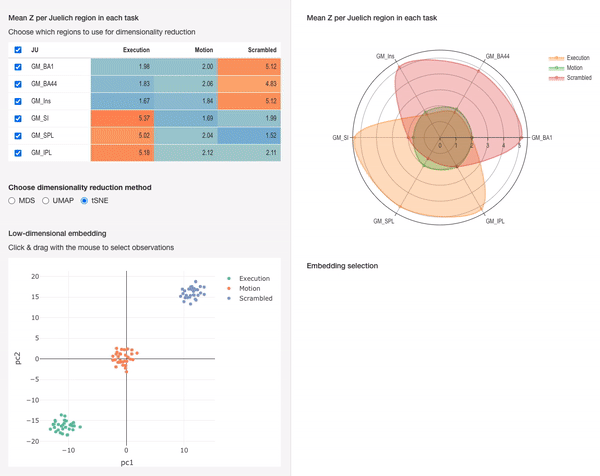

```{r setup, include=TRUE}
knitr::opts_chunk$set(echo = TRUE, warning=FALSE)
set.seed(124)
```


```{r echo=FALSE,message=FALSE}
library(magrittr)
library(shiny)
library(dplyr)
library(tidyr)
library(tibble)
library(reactable)
library(plotly)
library(ggplot2)
library(heatmaply)
library(uwot)
library(Rtsne)
library(DT)
options(digits = 2)
```

\
\


\
\
[Konrad Lorenz](https://en.wikipedia.org/wiki/Konrad_Lorenz){target="_blank"} once said that “It is a good morning exercise for a research scientist to discard a pet hypothesis every day before breakfast. It keeps him young” ([ref](https://www.oxfordreference.com/display/10.1093/acref/9780191826719.001.0001/q-oro-ed4-00006809;jsessionid=09C85D7EBCE0EBCDD5B27E04309183FE){target="_blank"}). Having spent quite some years doing scientific research, I can comfortably say that this is one of the mantra for the morning ritual of every researcher. Another useful mantra on the same line is a quote by [Richard Feynman](https://en.wikipedia.org/wiki/Richard_Feynman){target="_blank"}: “you must not fool yourself and you are the easiest person to fool” ([ref](https://archive.org/details/RICHARDP.FEYNMANSURELYYOUREJOKINGMR.FEYNMAN/page/n7/mode/2up?q=%22you+are+the+easiest+person+to+fool%22){target="_blank"}).

From a practical standpoint, these two quotes provide an interesting perspective on why I think visualization is so useful and actually indispensable for a researcher and for everyone who works with data: **images are a great device to show us when our hypotheses are correct _and_ when they are wrong** (or when there is something wrong in the data).

Visualization is key not just to communicate a complex result in an intuitive way, but also for inspecting every step of the analysis, in order to validate - or invalidate - previous assumptions, avoid wrong conclusions, get useful insights to re(de)fine our hypotheses, and design the next analytic step.

Another reason why data visualization is tremendously helpful in data analysis is that **data is always multifaceted**: when you look at it from different perspectives (e.g. different summary statistics, for different variables, observations, or groups of them), it shows one of its many aspect, and usually **a meaningful result stands out only when there is consistency among most of the perspectives from which we can look at our data**: only if it squeaks like a duck, looks like a duck, walks like a duck, then most likely it is... an interesting result. I find images great for this: being able to inspect at once different images showing different aspects of the data is very helpful to reveal consistencies and inconsistencies both in our data and in our hypotheses. 

**Interactive visualization takes this ability one step forward**. Now we can carry out some kind of transformation in one feature of our data - e.g. selecting different groups of variables - and see immediately the effect of this in other aspects of our data.  

In **neuroimaging** - the field where I worked for most time - this can be particularly useful, since the variables associated with both data pre-processing and actual data analysis are so many, that it is of paramount importance to check as much as possible each step of the process. Even restricing our focus to the actual analysis, the complexity associated with our research questions can grow very quickly: are the data from my participants homogeneous? How do they compare between the different tasks presented in the experiment? Is the effect restricted to only specific regions? Or maybe is it more evident when looking at sets (and potentially networks) of brain regions?

**In the following I will present a basic example of how different visualizations of the same data can help to inspect and gain insights on the results of a (fictitious) fMRI experiment**. I hope to show that while exploring even a simple dataset, the complexity of questions that come to the mind grows very fast. This prompts us to go back to the code, modify it, create new code chunks in our notebook for intermediate checks, and so on. This process can become very complex and - frankly - very messy. 

At this point, we might think about creating a device that allows us to look at all the different questions we have generated, and see how they affect the representation that we are creating in our mind about the data. **Therefore, I will show an interactive version of it, where the different tables and plots we generated react when something is changed in one of them (e.g. selecting different brain regions)**.

Not necessarily exploring data will prompt us to create an interactive app all the time, however its utility might become apparent for instance if we realize that such exploration steps might be useful for similar datasets in the future. 


### Github repos
- [for this RMarkdown document](https://github.com/leonardocerliani/psaraki-blog/blob/main/apps/dimred_app/dimred_app.Rmd){target="_blank"}
- [for the interactive Shiny app](https://github.com/leonardocerliani/neuroimaging_dimred){target="_blank"} - which can be opened in full page on [shinyapps.io](https://agronomous.shinyapps.io/neuroimaging_dimred/){target="_blank"}

_Caveat: the data in this example are totally made up, they do not come from an actual experiement, since the aim is to show the potential of building such a tool. However, this machinery can be easily adapted to real data and personalized to the need of the investigator._


## A simple fMRI experiment
Suppose you want to compare brain activity during the execution of three different tasks: `AAA`, `BBB` and `CCC`. These tasks are behaviourally different, and your hypothesis is that this is reflected in which brain regions are recruited to perform each task. To test this hypothesis you set up an fMRI experiment where 30 participants execute many times each task while being in the scanner (this is an _extremely_ simplified description of an fMRI experiment). The brain activity is recorded in each brain region, but for simplicity here we will focus only on nine of them. 

For the purpose of showing the utility of our visual exploration of the data, we will generate fictitious data which is in accordance with the hypothesis. Specifically, I will generate summary statistics (mean activity) from 30 participants, showing that some brain regions are more active in task `AAA` and some in task `CCC`, while all examined brain regions do not appear to be particularly activated by task `BBB`.


```{r}

N = 30

A <- function(mu) rnorm(N, mean = mu)

df <- tibble(
 task = c(rep("AAA",N), rep("BBB",N), rep("CCC",N)) %>% as.factor(),
  BA44  = c(A(2), A(2), A(5)),
  BA45 = c(A(2), A(2), A(5)),
  BA46  = c(A(2), A(3), A(5)),
  V1  = c(A(2), A(2), A(2)),
  V4  = c(A(2), A(2), A(2)),
  V5  = c(A(2), A(2), A(2)),
  SI   = c(A(5), A(2), A(2)),
  SPL  = c(A(5), A(2), A(2)),
  IPL  = c(A(5), A(3), A(2))
) %>% 
 group_by(task) %>%    # assign participant numbers
 # mutate(sub = paste0("sub_",row_number())) %>%
 mutate(sub = paste0("sub_",row_number(),"_",task)) %>%
 relocate(sub) %>%
 ungroup()
 

# # plant an outlier
# df[c(30,60,90),] %<>%  mutate(across(BA44:IPL, ~ .x + 4))

# define a reusable function to print the table
show_table <- function(df) {
 
 BuYlRd <- function(x) {
   rgb(colorRamp(c("#7fb7d7", "#ffffbf", "#fc8d59"))(x), maxColorValue = 255)
 }
 
  reactable(
    df,
   resizable = T,
   # selection = "multiple",
   # onClick = "select",
   defaultColDef = colDef(
     style = function(value) {
        vals <- df %>% select(where(is.numeric))
        if (!is.numeric(value)) return()
        normalized <- (value - min(vals)) / (max(vals) - min(vals))
        color <- BuYlRd(normalized)
        list(background = color)
      },
     format = colFormat(digits = 2), minWidth = 50
   ),
   style = list(fontFamily = "Arial narrow", fontSize = "13px")
  )
}

df %>% show_table()


```


This is our complete dataset. It is very simplified (and clean) with respect to a real fMRI dataset, but it shows the many levels at which an fMRI can be examined:

- across participants
- across tasks
- across brain regions

and of course all the combinations of these levels. For instance we might be interested at the effect of a given task with respect to the other two in a specific brain region or in a specific set of brain regions.

**Here we start to see how quickly the complexity increases for the questions that we might ask even in a simple experiment like this.** (It's here that the interactive exploration will reveal its potential as we will see later).

Although in this table I already color-coded brain the mean activity in each region for each task and each subject, it is quite difficult to have a clear view of the results.


## Effect of task in different brain regions across participants
At this point we want to check whether the effect we hypothesize is consistent across participants. This is done to achieve a robust estimate of our effect of interest (and of its variability). One basic visualization of this mean result is in the form of a table:


```{r}
df_mean <- df %>% 
 group_by(task) %>%
 summarise(
  across(where(is.numeric), ~ mean(.x, na.rm = T)),
  .groups = "drop"
 )

# df_mean %>% show_table()

# pivot to group all the brain regions in a variable
t_df_mean <- df_mean %>% 
 pivot_longer(
  cols = !task, names_to = "JU", values_to = "Zmean"
 ) %>% 
 pivot_wider(
  names_from = task, values_from = Zmean
 )

t_df_mean %>% show_table()
```
\
\
Now the situation appears much more clear than when we looked at the data at the participant level, and indeed reflects how we actually generate the data: tasks `CCC` and `AAA` activate mostly the three top and bottom brain regions, respectively, while task `BBB` does not appear to activate any of the examined brain regions above baseline. 


## A different visualization
Consider however that here we are looking only at 9 brain regions, while in reality - in a whole-brain analysis - we look at least at 50+ regions (e.g. the 52 [Brodmann areas](https://en.wikipedia.org/wiki/Brodmann_area){target="_blank"}). That is why I prefer to look at the same result with a graphical representation such as the following one.

_NB: in the following graph you can select specific tasks by clicking on the legend_

```{r}
draw_spiderplot <- function(t_df_mean) {
  
  p <- plot_ly(
    type = 'scatterpolar', mode = 'lines+markers', fill = 'toself', opacity = 0.5
  ) %>% config(displayModeBar = F)
  
  df_vals <- t_df_mean %>% select(-JU)
  ticks <-  t_df_mean$JU %>% as.character()
  groups <- df_vals %>% colnames()
  
  for (ith_col in 1:length(groups)) {
    
    onecol <- df_vals[,ith_col] %>% pull()
    
    p <- p %>%
      add_trace(
        r = c(onecol, onecol[1]),
        theta = c(ticks, ticks[1]),
        name = groups[ith_col],
        line = list(
          dash = "solid",
          shape = "spline",
          smoothing = 1,
          width = 2
        )
      ) %>% layout(font = list(family = "arial narrow"))
  }
  
  return(p)
}

draw_spiderplot(t_df_mean)

```

## Reducing the dimensionality for a sharper view
I find this visualization much easier to inspect than the table above. However, you might have noticed that we don't know anymore what is going on at the level of the single participants. Of course are insights on the results so far are purely based on descriptive statistics, and appropriate inferential methods (e.g. ANOVA) will tell us whether the variability across tasks is substantially higher than that between participants. However, it can be useful to have a first look into this by looking at the main trajectories of variability across the entire initial dataset. 

Let's see for instance what happens when we feed our initial participants-by-brain region table into [UMAP](https://umap-learn.readthedocs.io/en/latest/){target="_blank"}. 


```{r}
do_dimred <- function(df, method, compX, compY, maxcomp=3) {
  
  # nsub <- length(df$task)
  vals <- df %>% select(!task) %>% as.matrix()
  
  switch(method,
         mds = {
           mds <- cmdscale(dist(vals), eig = T, k = maxcomp)
           pcs <- list(mds$points[,compX], mds$points[,compY])
         },
         umap = {
           u <- umap(dist(vals), n_components = maxcomp)
           pcs <- list(u[,compX], u[,compY])
         },
         tsne = {
           tsne <- Rtsne(dist(vals), dims = 3, perplexity = 10)
           pcs <- list(tsne$Y[,compX], tsne$Y[,compY])
         }
  )    
  
  df_lowdim <- tibble(
    task = df$task,
    sub = df$sub,
    pc1 = pcs[[1]],
    pc2 = pcs[[2]],
  )
  
  plot_ly(type = 'scatter', mode = 'markers', source = "A") %>%
    add_trace(
      data = df_lowdim,
      x = ~pc1,
      y = ~pc2,
      customdata = ~sub,
      color = ~task,
      text = ~sub,
      hoverinfo = 'text'
      # hovertemplate = paste('%{text}')
    ) %>% 
    layout(dragmode = "lasso") %>% 
    config(displayModeBar = F)
}

do_dimred(df,"umap", compX = 1, compY = 2)

```

\
\
Here each point represents one participant performing one task. The data is grouped in three clusters reflecting - not surprisingly - the difference in brain activity across all particiants and between tasks. 

Interestingly, we see that the brain activity for task `BBB` in one participant is grouped with a cluster which is mostly populated with activity for task `AAA` (hover on the orange dot in the green cloud). To inspect this potential anomaly, we can look into the initial data table and inspect the original values. Eventually we can go back to the original fMRI data and - through appropriate examination - decide if something went wrong with the data of this participant, e.g. during data acquisition or pre-processing.

This situation is made more clear if we artificially "plant" an anomaly in our data. I will not run this here, but you can download this RMarkdown notebook and run it on your computer. Check out how the UMAP is able to spot the "outliers" which were planted in the data.

```{r eval=FALSE}
# plant an outlier
gf <- df
gf[c(29,30,59,60,89,90),] %<>%  mutate(across(BA44:IPL, ~ .x + 4))

do_dimred(gf,"umap", compX = 1, compY = 2)

gf %>% show_table()

```


## Bringing all together in an interactive app

We have seen so far how many questions naturally arise even when looking at a intentionally very simplified dataset like the one we generated above.

If you read so far you have probably come up with a few other features that you would like to explore in one of the proposed visualization, and see how they affect the other perspectives from which we can look at the data. 

It is probably clear by now that I am very intrigued by the possibility of exploration offered by dimensionality reduction methods such as UMAP. In the app which is displayed below, that you can [open in full screen here](https://agronomous.shinyapps.io/neuroimaging_dimred/){target="_blank"}, I implemented a few other possibilities that I encourage you to explore:

- For instance, we might want to assess - for data exploration or based on a specific hypothesis - whether the expected effect would hold if you **consider only a subset of the brain regions** we looked at. This can be done by selecting the regions in the table, and observing the effect in the low-dimensional embedding.

- We might also want to try to **use other dimensionality reduction methoods** besides UMAP (check for instance [here](https://cmdlinetips.com/2022/07/dimensionality-reduction-techniques-in-r/){target="_blank"}). In the app, there is a choice of three different methods: Multi-dimensional Scaling (from the [stats](https://www.rdocumentation.org/packages/stats/versions/3.6.2/topics/cmdscale){target="_blank"} package), tSNE (from the [Rtsne](https://cran.r-project.org/web/packages/Rtsne/index.html){target="_blank"} package) and UMAP (from the [uwot](https://cran.r-project.org/web/packages/uwot/index.html){target="_blank"} package).

- Also, to **inspect the original values for each participant in each task**, you just have to draw a lasso around the points you are interested in the low-dimensional embedding, and a heatmap of those values will appear in the lower-right corner of the app

Hopefully the potential usage of the app are self-explanatory, but if in doubt, check the animated gif at the beginning of this post.


```{r echo=FALSE}
knitr::include_app("https://agronomous.shinyapps.io/neuroimaging_dimred/", height = 2100)
```


## Conclusion
This post has already become much bigger than what I expected. I hope you found it useful or at least interesting, and I would be glad to know what you think about it by dropping me an email.

I just want to offer two small considerations to conclude. 

- Building an interactive app for data exploration/analysis is something that I dreamt about ever since I started to learn Matlab many years ago. Nowadays with the introduction of libraries such as [Shiny](https://shiny.rstudio.com/){target="_blank"} for R (and recently also for Python), it has become a task that **anyone with an interest in coding can get started with in a relatively short time**, and that I personally find satisfying on many different levels. When you get a bit of experience, prototyping a basic app can take as short as one or a few days (as a matter of fact it took me way more time to write this post than the app)

- In this example I looked only at the participant-level results. Instead **in neuroimaging a large amount of time and code is spent on pre-processing the data and checking the results of the many steps involved therein** - e.g. checking the outcome of registering one brain to a template, or the whole-brain temporal profile of an fMRI volume after bandpass filtering or de-noising. Although many neuroimaging suite already did a great job in implementing GUIs, you might want to look into other features which are not currently offered, or you might just want to implement an interface for the pre-processing pipelines you wrote. Having this in mind, I believe that libraries like Shiny  bring a great potential for developing such personalized tools for researcher in neuroimaging.  


```{r eval=FALSE, include=FALSE}

df %>% head(15) %>% 
 arrange(task) %>%
 # mutate(sub = paste(sub,task,sep = '_')) %>%
 column_to_rownames(var = "sub") %>% 
 heatmaply(Colv = NA, Rowv = NA, scale="none", colorbar_xanchor = "left") %>% 
 config(displayModeBar = F) %>% 
 layout(font = list(family = "arial narrow"))

 

```

